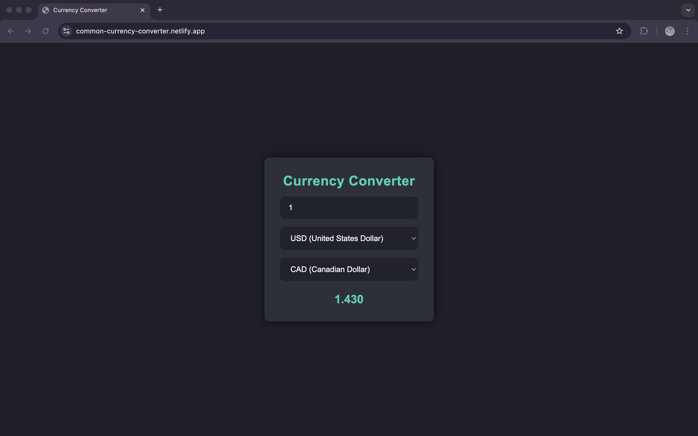

# Currency Converter
A simple and sleek currency converter built with **React**. It allows users to convert from one currency to another in real-time using the [Frankfurter API](https://www.frankfurter.app/).

## Live Demo

Check out the live demo here:  
**[Common Currency Converter](https://common-currency-converter.netlify.app/)**

  

## Features

- **Real-Time Conversion**: Fetches up-to-date exchange rates from the [Frankfurter API](https://www.frankfurter.app/).  
- **Multiple Currencies**: Includes options for common world currencies.  
- **Loading Indicator**: Shows a “Converting...” overlay while fetching data.  
- **Clean UI**: Modern, minimal, and responsive layout.

## Installation & Setup

1. Clone the repository:
   ```bash
   git clone https://github.com/andyTuruu/currency_converter.git
2. Navigate to your directory
3. Install dependencies: 
   ```bash
   npm install
4. Start the development server:
   ```bash
   npm run dev
5. Open http://localhost:5173 (or whichever port Vite is using) in your browser to see the app in action.

## Usage
1. Enter the amount you wish to convert
2. Select your base currency
3. Select the target currency
4. The app will display the converted amount as soon as the API call completes. 

