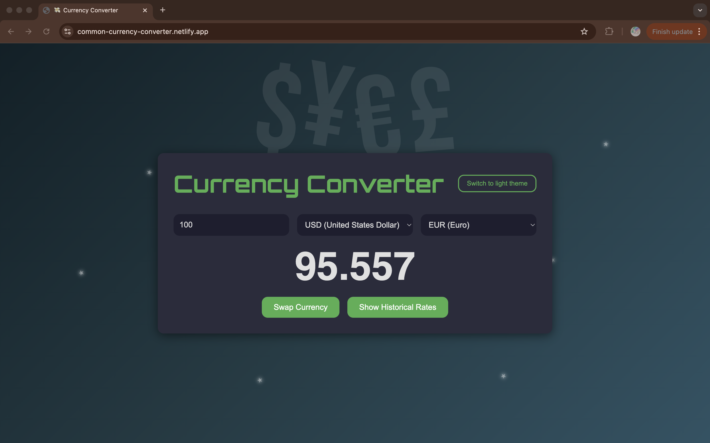
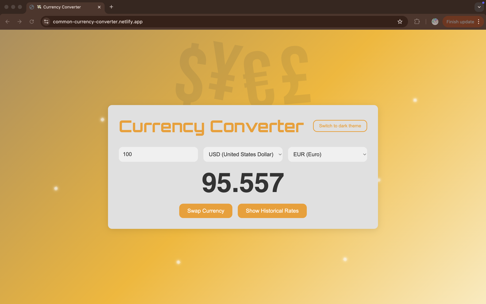
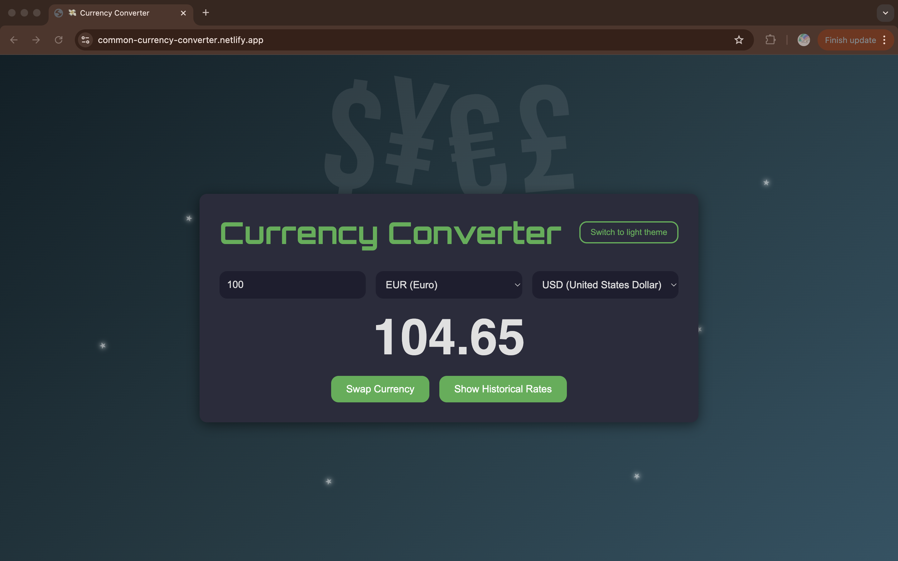
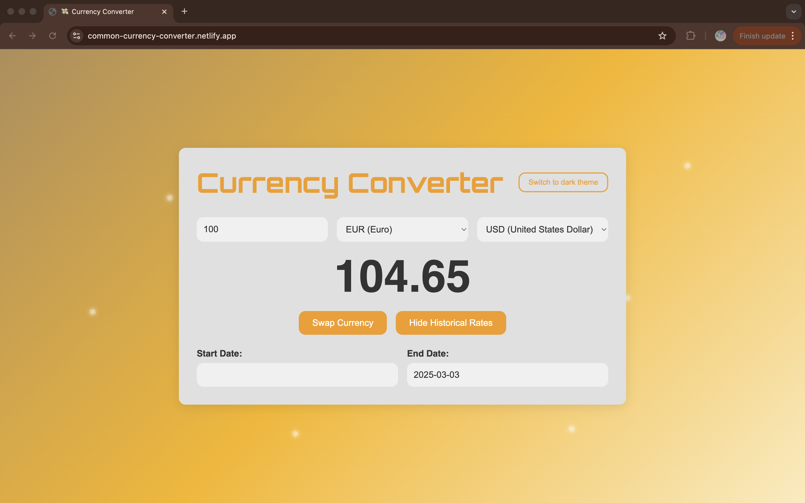
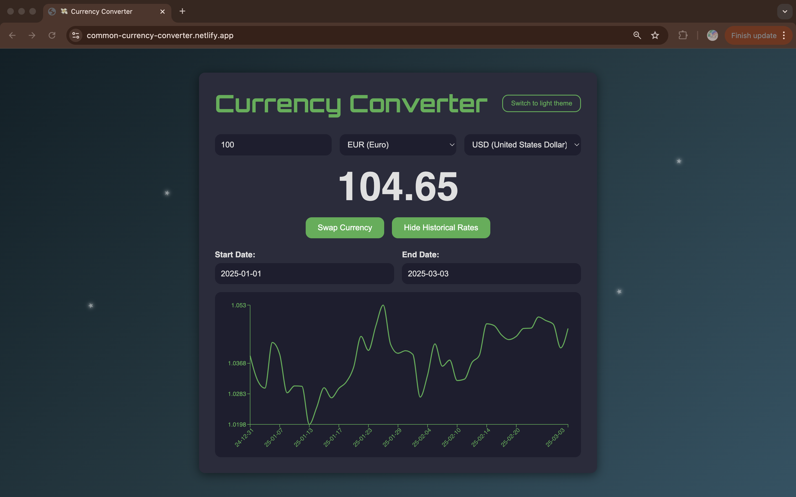

# Currency Converter

A responsive React-based currency converter app that not only converts current exchange rates but also displays historical trends. The app features a modern, dynamic design with custom theming (light/dark mode) and detailed historical charts.

Check out the live app here:  
**[Common Currency Converter](https://common-currency-converter.netlify.app/)**

  
  
  
  
  

## Features

- **Real-Time Conversion**:
  Quickly convert between currencies using live data from the [Frankfurter API](https://www.frankfurter.app/).

- **Historical Trends**:
  View historical exchange rate data with interactive charts that adjust dynamically to your screen size.

- **Responsive Design**:
  Optimized for both desktop and mobile devices with thoughtful responsive styling.

- **Dynamic Theming**:
  Toggle between light and dark themes for a personalized user experience.

- **Playful Background**:
  Enjoy subtle currency symbols that adapt based on your screen size and randomly generated glowing suns/stars in the background.

## Installation & Setup

1. Clone the repository:
   ```bash
   git clone https://github.com/andyTuruu/currency_converter.git
   ```
2. Navigate to your directory
3. Install dependencies:
   ```bash
   npm install
   ```
4. Start the development server:
   ```bash
   npm run dev
   ```
5. Open http://localhost:5173 (or whichever port Vite is using) in your browser to see the app in action.
